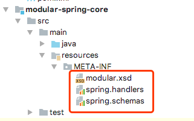

# 如何实现模块中的服务接口的发布与引用
## 基本思想
因为模块之间的ApplicationContext之间相互隔离，所以一个模块发布的服务不能被直接注入
到另一个模块的bean中，面服务的发布入引用的模块之间可能无依赖关系，这意味着服务引用方
初始化时，服务发布方可能还没有初始化，所以需要在服务引用方使用代理来达到目的。

如何使用代理达到跨模块之间的服务引用呢？通过modular:service标签在spring中配置的服务
接口会被一个全局的ServiceManager托管，而通过modular:reference标签在spring中配置
的服务引用会通过动态代理创建一个代理对象，并被spring注入到需要使用此服务的bean中，初始
时代理对象中的目标对象（即服务提供对象）是null，当第一次在代理方法上执行方法调用时，代理
对象会从ServiceManager中获取服务提供对象

## modular命名空间的xml配置的实现方式
spring支持自定义命名空间，每个命名空间对应一个xsd文件和一个NamespaceHandler，如果
需要自定义命名空间则需要按照spring的规范提供xsd文件和NamespaceHandler的实现。例如
modular-spring-core中的自定义标签实现：



* modular.xds文件中是对modular:service和modular:reference标签的定义
* spring.handlers中是命名空间和NamespaceHandler之间的对应关系
* spring.schemas中是命名空间对应的xds文件路径与实际路径之间的关系

spring.handlers中的内容：
```properties
http\://www.yxffcode.cn/modular=cn.yxffcode.modularspring.core.ModularNamespaceHandler
```
spring.schemas中的内容:
```properties
http\://www.yxffcode.cn/modular.xsd=META-INF/modular.xsd
```

说完了spring对自定义xmlns的支持，再来看看具体的标签解析.

在Spring中，一个bean会被装配成一个BeanDefinition对象，BeanDefinition对象是对一个bean
的描述，包括bean的类型，bean的依赖等。而xmlns中，一个标签对应BeanDefinitionParser，用于
向Spring中注册BeanDefinition对象。BeanDefinitionParser对象通过NamespaceHandler注册。
例如ModularNamespaceHandler:
```java
public class ModularNamespaceHandler extends NamespaceHandlerSupport {
  @Override
  public void init() {
    registerBeanDefinitionParser("service", new ServiceBeanDefinitionParser());
    registerBeanDefinitionParser("reference", new ReferenceBeanDefinitionParser());
    registerBeanDefinitionParser("extension", new ExtensionBeanDefinitionParser());
    registerBeanDefinitionParser("extension-point", new ExtensionPointBeanDefinitionParser());
  }
}
```
具体的BeanDefinition对象的注册逻辑可以看看上面的几个BeanDefinitionParser的实现类。

## 服务的发布与引用的实现
modular:service标签会向spring中注册一个ServiceBean对象，ServiceBean的部分代码如下:
```java
public class ServiceBean implements ApplicationContextAware {
  private String ref;
  private String interfaceName;
  private String uniqueId;
  private ApplicationContext applicationContext;

  public ServiceBean(String beanRef, String interfaceName, String uniqueId) {
    this.interfaceName = interfaceName;
    this.uniqueId = Strings.nullToEmpty(uniqueId);
    this.ref = beanRef;
  }

  @Override
  public void setApplicationContext(ApplicationContext applicationContext) throws BeansException {
    this.applicationContext = applicationContext;
    ServiceManager.registryService(this);
  }
}
```
可以看到，在模块的Spring初始化后，会向ServiceManager中注册一个ServiceBean

modular:reference标签则是通过向spring注册一个代理来实现服务的引用，部分代码如下:
```java
public final class ServiceReference implements FactoryBean<Object> {
  private final Class<?> targetClass;
  private final String uniqueId;

  public ServiceReference(Class<?> targetClass, String uniqueId) {
    this.targetClass = targetClass;
    this.uniqueId = Strings.nullToEmpty(uniqueId);
  }

  @Override
  public Object getObject() throws Exception {
    return Reflection.newProxy(targetClass, new AbstractInvocationHandler() {
      private Object delegate;

      private void initDelegate() {
        final ServiceBean service = ServiceManager.getService(targetClass.getName(), uniqueId);
        if (service == null) {
          throw new ServiceLocatingException("服务 " + targetClass + " 没有找到,请检查是否是模块依赖不正确");
        }
        final ApplicationContext ctx = service.getApplicationContext();
        this.delegate = ctx.getBean(service.getRef());
      }

      @Override
      protected Object handleInvocation(Object proxy, Method method, Object[] args) throws Throwable {
        if (delegate == null) {
          synchronized (this) {
            if (delegate == null) {
              initDelegate();
            }
          }
        }
        return method.invoke(delegate, args);
      }
    });
  }
}

```
ServiceReference是一个FactoryBean，Spring在初始化服务引用对象时，会调用ServiceReference.getObject()
方法获取一个动态代理对象，可以看到在代理对象上第一次调用方法时会从ServiceManager中获取真实的服务对象。